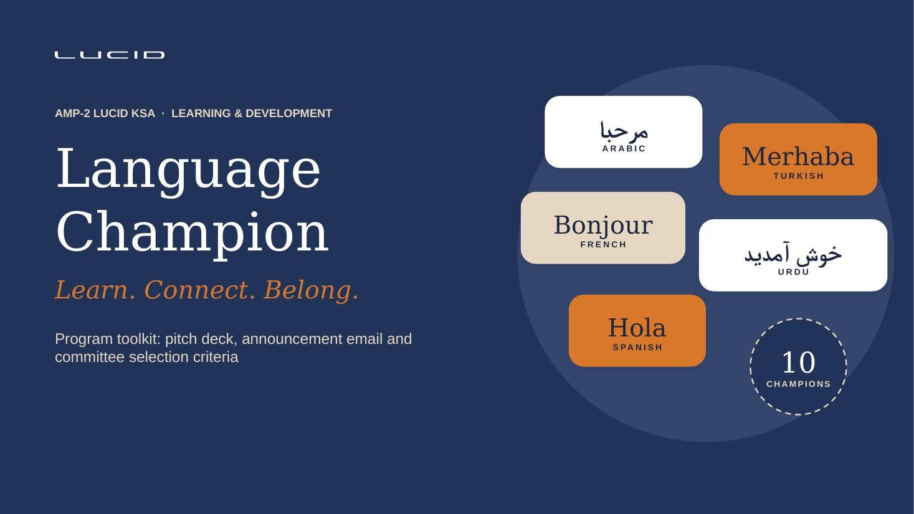
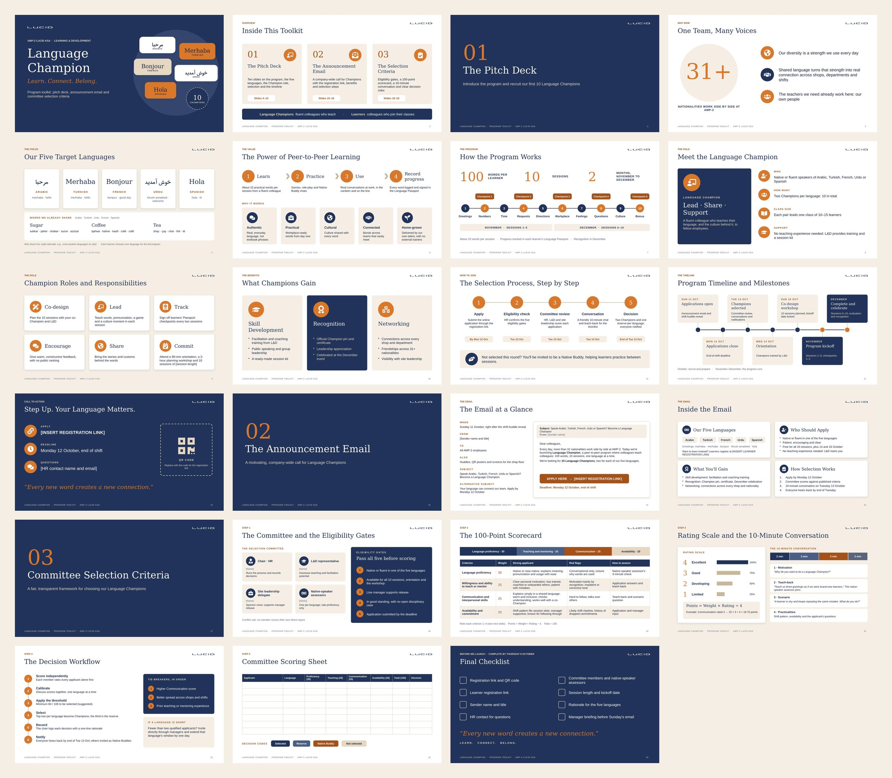
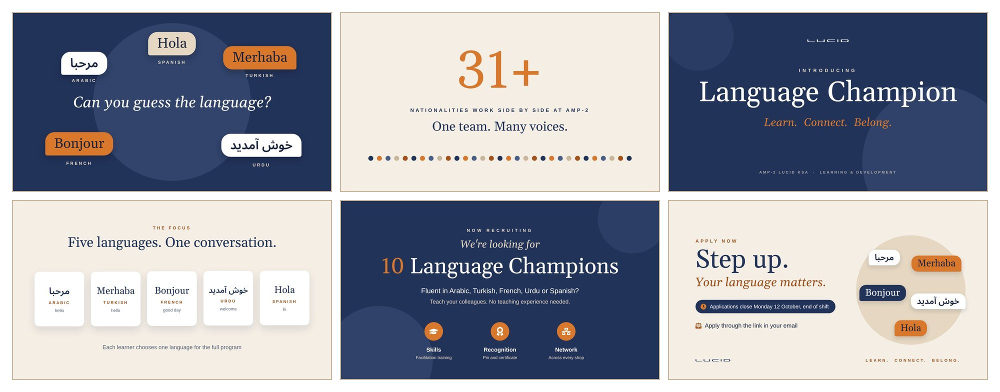

# Language Champion · Program Toolkit

A 23-slide PowerPoint for launching **Language Champion**, AMP-2's peer-to-peer language program: colleagues who speak Arabic, Turkish, French, Urdu or Spanish teach their language to fellow employees.



**[Download the deck](output/Language_Champion_Program_Toolkit.pptx)** — native, fully editable PowerPoint (16:9), with speaker notes on every slide.

## What's inside

| Part | Slides | Content |
| --- | --- | --- |
| Overview | 1–2 | Title slide and a guide to the toolkit |
| 1 · The pitch | 3–13 | Why now, the five languages, peer-to-peer learning, how the program works, the Champion role and responsibilities, benefits, selection process, timeline, call to action |
| 2 · Announcement email | 14–16 | Send plan, email mock-up and its key sections; the full email text is in the speaker notes of slide 15 |
| 3 · Selection criteria | 17–22 | Committee and eligibility gates, 100-point scorecard, rating scale, 10-minute conversation, decision workflow, printable scoring sheet |
| Launch | 23 | Checklist of every placeholder to complete before sending |



## Motion teaser

A 33-second animated teaser for site screens, shift huddles and Teams: **[watch or download the MP4](motion/output/Language_Champion_Teaser.mp4)** (1920 × 1080, 30 fps, 2.5 MB, no sound so it works on muted screens). It loops cleanly, so it can run continuously.



| Time | Scene |
| --- | --- |
| 0–5 s | Greetings pop up in five languages: "Can you guess the language?", then the answers appear |
| 5–9 s | A count to 31+ nationalities: "One team. Many voices." |
| 9–13 s | Title reveal: Language Champion · Learn. Connect. Belong. |
| 13–18 s | The five languages |
| 18–22 s | 100 words, 10 sessions, 2 months, and the session roadmap |
| 22–27 s | "We're looking for 10 Language Champions", with the three benefits |
| 27–33 s | Apply now: deadline, how to apply, Lucid logo |

To put a scannable QR code on the end card, add the link to `motion/config.json` and re-render:

```json
{ "registrationUrl": "https://your-form-link", "displayUrl": "short.link/apply" }
```

```bash
npm install
npx playwright install chromium   # one-time browser download for rendering
npm run motion                    # writes motion/output/Language_Champion_Teaser.mp4 (needs ffmpeg)
```

You can also open `motion/teaser.html` in any browser to play it live, full screen and looping. The animation is in `motion/teaser.template.html`; the deadline text is in `motion/config.json`.

## Before you present

Replace the bracketed placeholders:

- `[INSERT REGISTRATION LINK]` and the QR code on slide 13
- `[INSERT LEARNER REGISTRATION LINK]`
- `[Sender name and title]` and `[HR contact name and email]`
- Committee member names on slide 18
- `[session length]` on slide 9 and the kickoff date
- The rationale for the five languages on slide 5

## Design

The deck uses the AMP-2 Lucid house style: navy `#22335A`, light sand `#F4EEE5` and orange `#D9772B`, with Georgia headings and Arial body text. The colours are built into the PowerPoint theme, so they appear in the colour picker when you edit.

The full specification — palette, type scale, grid, components and rules — is in [docs/design-spec.md](docs/design-spec.md). You can paste it into any AI tool as a design brief to produce new decks in the same style.

## Rebuild or edit the deck

The deck is generated from code, so a change to the content or design is one edit and one command.

```bash
npm install
npm run build          # writes output/Language_Champion_Program_Toolkit.pptx
```

Requires Node.js 18 or later.

| To change | Edit |
| --- | --- |
| Slide text, layout or order | `src/build.js` (one block per slide, in order) |
| Colours and fonts | the `THEME` object at the top of `src/build.js` |
| The announcement email | `content/announcement-email.txt` |
| Logo | `assets/lucid-navy.png` and `assets/lucid-white.png` |

## Repository layout

```
assets/        Lucid wordmark in navy (light slides) and white (dark slides)
content/       Announcement email text, inserted into the speaker notes
docs/          Design specification and preview images
motion/        Teaser animation: template, renderer, settings, open-licence fonts and the rendered MP4
output/        The built PowerPoint
src/           Deck generator (pptxgenjs) and theme-colour step
```

The teaser uses Gelasio, Arimo and Noto Sans Arabic (SIL Open Font License; licences in `motion/fonts/`). Gelasio and Arimo share the character widths of the deck's Georgia and Arial, and bundling them means the video renders the same on any machine.
